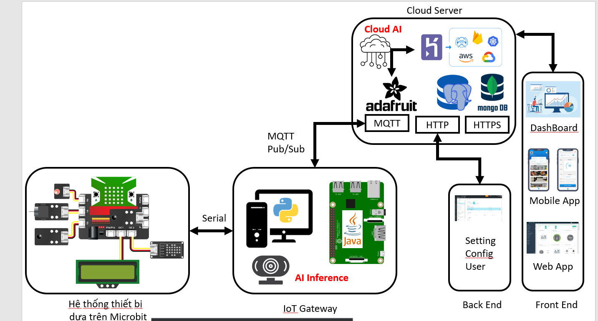

# Note for meeting #1

Ngày 19/09/2023

Hiện diện:
- Hoàng 
- Thành
- Tùng

## Kế hoạch

1. Xem lên lab xem qua mạch thực tế, tìm hiểu về các khả năng của mạch
2. Dựa vào khả năng của mạch, đề ra các ý tưởng cơ bản cho dự án (làm gì, dùng gì, cung cấp gì)

## Nội dung

### Lab 

Không lên được do không tìm được phòng trên H6 => Mail thầy để hỏi lại.

### Ý tưởng cơ bản cho dự án

Qua nhìn nhìn về các phần cứng được cung cấp, nhóm đề xuất ra một số ý tưởng hiện thực một ngôi nhà
thông minh hơn

#### Cảm biến và các thiết bị điều kiển được và ứng dụng học máy

Có hứng thú với cảm biến hồng ngoại, cảm biến nhiệt độ và độ ẩm, cảm biến khoảng cách.

Dùng servo để điều khiển đóng mở cửa. Dùng relay để thực hiện bật tắt các thiết bị. Dùng máy bơm để
tưới nước tự động cho cây.

Sử dụng camera tự cung cấp (hay sử dụng camera điện thoại) và các mô hình học máy, **dò ra được có
người hiện tại ở trong phòng hay không**, các kết quả dò được có thể được dùng để ra quyết định điều
khiển bật tắt thiết bị (đèn, quạt, điều hòa). Camera cũng có thể được dùng để thực hiện nhận diện
khuôn mặt (chức năng tương tự FaceID).

#### Yêu cầu functional

Thông tin (trạng thái của các đại lượng được quan sát, kết quả của mô hình học máy, các dữ liệu tổng
hợp khác) sẽ được hiển thị trên một app di động hay giao diện web trong trình duyệt. Các framework
hỗ trợ chuyện này vẫn còn đang được quyết định.

Điều khiển có thể được gửi từ trao diện nêu trên (web hay app), điều khiển các thiết bị được nối vào
hệ thống (quạt, đèn).

#### Yêu cầu non-functional

Giao diện cần "đẹp". Chưa rõ lắm yêu cầu này, nhưng có thể sẽ phải dùng một số framework thích hợp
để dễ thực hiện yêu cầu này.

### Kiến trúc hệ thống nói chung

Nhóm bắt đầu bàn từ mô hình kiến trúc đã được gợi ý

Nhóm đề ra môt số ý tưởng, chi tiết cần phải tìm hiểu nhiều hơn:
- Kết nối Google assistant để hỗ trợ tích xử lí giọng nói
- Sử dụng một database trung tâm để truy cập khi cần tổng hợp thông tin (tương tác với server MQTT
của Adafruit vẫn chưa rõ)

### Cần làm

- Mail hỏi lịch trực phòng
- Tạo git
- Tìm hiểu về Yolo:bit
