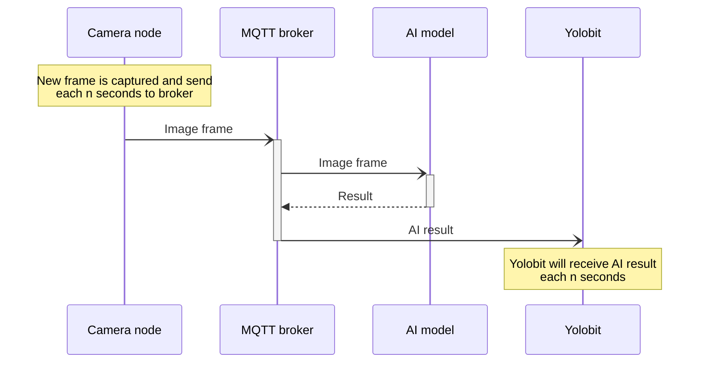

# Sequence diagram for use cases within the system

## Get current state of system

## Send command to Yolo:bit

## Get information sent from Yolo:bit into database

## Yolo:bit wait for AI model result (in light control/door control)

