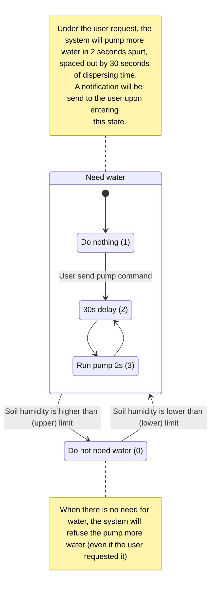
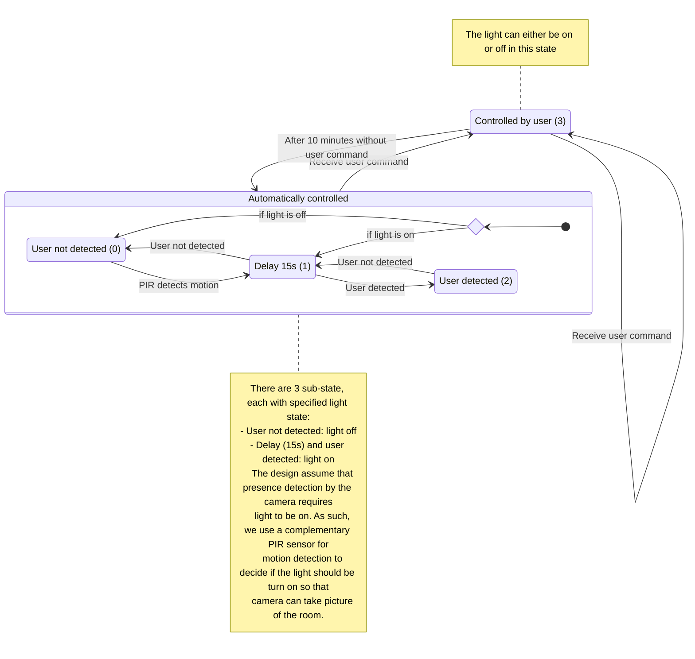
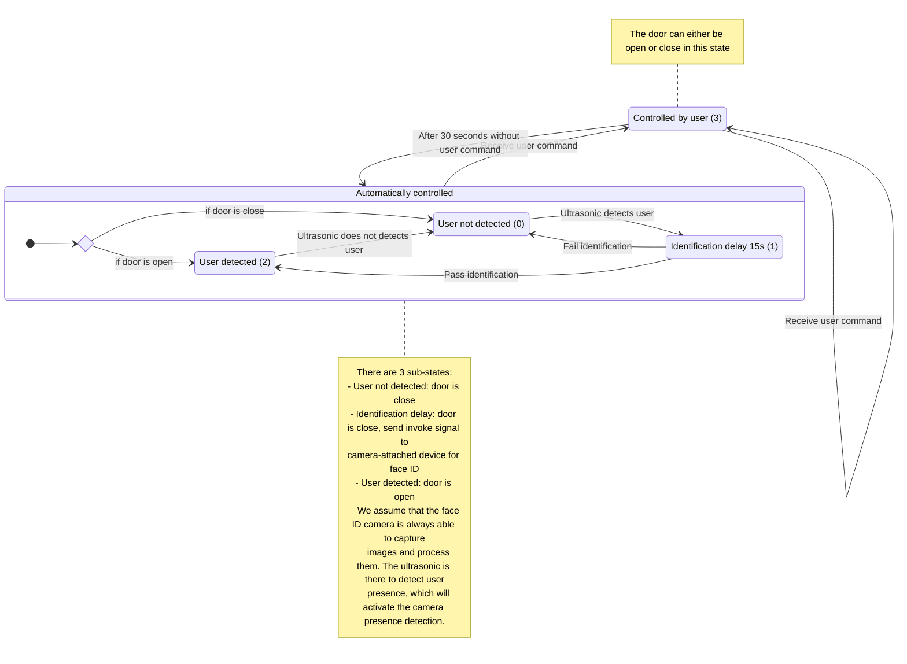

# Outline of project

Input: 
- PIR sensor - P0
- Temp and humidity (DHT20) - I2C1 port
- Soil humidity - P1 (ADC) port
- Ultra sonic - dual port P3/P6
- Camera - not really an input but needed, on laptop or phone
    - one for presence detection 
    - one for face id and presence detection

Output:
- Relay - P2
- Fan - P14/P15
- Servo - header P4
- Buzzer - onboard
- RGB LED - P16/P12
- Pump - dual port P10/P13

Functionality:
- Door control (open/close) - with face ID and proximity sensor
- Device control
    - Fan control (with PWM)
    - Other device control (with relay)
    - Light control (RGB LED), which will use AI and PIR for presence detection
- Plant watering
- Environment monitoring
    - Ground humidity
    - Air temp/humidity

# General detail from the Yolo:bit viewpoint

## Reading sensor (input)

- Using event, read the value of the sensor every x seconds:
    - PIR sensor (high/low) voltage, indicating have/have not people
    - DHT20, through I2C, update readings, then read them
    - Soil humidity, read value within range (0, 100)
    - Ultra sonic (use command to read value)

- AI result on dedicated MQTT topic: can not be read, but received from the server
    - presence detection result
    - face id result

## MQTT message format

We assume that there is multiple implementation of the system, each with different `room_id` and
`house_id`. All instance of the system will send/receive by the same centralized topic. So to
differentiate each instance, every packet of information sent/received by the system must have the
following format: `<house_id>;<room_id>;<content>`.

Each Yolo:bit instance is expected to be able to parse the packet, determining if the packet is
directed toward itself or not. If `house_id` and `room_id` match, then process the content; if not
then discard the packet.

## Control signal sent through MQTT topics

Since we are not sure about the QoS provided by the Yolo:bit, and also because we need some type of
feedback when remotely controlling the system. For each control topic, there will be a state topic
representing the current state of the peripherals. There will also be a result code topic for each
action.

All the control triplet are:
- For the door (servo)
- Fan
- Relay
- RGB LED color
- Pump

There will be other topics serving other functionality, those will be mentioned with the
functionality description.

**Assumption:** for control triplet (unless noted otherwise), "0" string means negative,
deactivated, disabled; "1" string means positive, activated, enabled. This is applied only to
command and status topic. The result code return can have arbitrary string.

# Specific for all use case

## Current state reporting

### Description

We need a way for the system to report its current state (input/output states). Not really a user
facing use case, since only other component communicating with the Yolo:bit need this.

We define a topic, into which the Yolo:bit will listen. If any message is publish into this topic,
the system will responds with it states.

### MQTT topics

- Input state:
    - `<prefix>/report_current state/input`
- Output state (we only send door, light, pump, relay, fan)
    - `<prefix>/report_current state/output`

## Environment monitoring

### Description

Read sensor (DHT20, soil humid). For each sensor, sent info through MQTT to broker->database

### MQTT topics

- Air temp topic 
    - `<prefix>/input/air_temp`
- Air humidity topic 
    - `<prefix>/input/air_humid`
- Soil humidity topic
    - `<prefix>/input/soil_humid`

## Plan watering

### Description

The plant is watered when only when the soil humidity is low enough. The user can trigger the
watering. Upon detection of dry soil, a notification is send to the user.

To prevent over-watering, a sequence of 30s of idle time + 2s of pump run time is used. This will
hopefully ensure the water have time to spread out and affect the sensor reading (prevent pumping
too much water too fast).

### MQTT topics

- Pump control triplet
    - `<prefix>/output/pump/state`
    - `<prefix>/output/pump/result`
    - `<prefix>/output/pump/command`
- A notification topic
    - `<prefix>/plant_watering/notification`

## Light control

### Description

The light can be controlled by the user by changing the RGB triplet value. To turn off the light,
set the triplet to (0, 0, 0). Any color and brightness is achievable through changing this triplet.

For the light on/off control, activation can also be achieved through 
- User control
- PIR motion detection at night.

The set RGB triplet will persist up until the automatically turn off. When it automatically turn on
again, the color will be fixed (hard-coded), user have to change this again.

### MQTT topics

- light color control triplet 
    - `<prefix>/output/rgb_led/state`
    - `<prefix>/output/rgb_led/result`
    - `<prefix>/output/rgb_led/command`

    **Note**: The value sent to state and command will be a concatenation of the RGB triplet writen
    in decimal value, zero-filled to 3 digit, in that specific order.

    **Example**: For #FFFFFF, the corresponding string is "255255255"; for #000000, the string is
    "000000000"; for #00FF00, the string is "000255000".

- human presence result from AI topic
    - `<prefix>/light_control/presence`

- light control notification
    - `<prefix>/light_control/notification`

## Fan control / Other device control

### Description

The device (fan, relay-connected device) can be controlled remotely by the user. The user can
see device state.
- For fan: PWM duty cycle
- For relay: On/Off state 

### MQTT topics

- For fan: control triplet
    - `<prefix>/output/fan/state`
    - `<prefix>/output/fan/result`
    - `<prefix>/output/fan/command`

    **Note**: The value sent to state and command will be a natural number in range [0-100],
    formatted as a string.

- For relay: control triplet
    - `<prefix>/output/relay/state`
    - `<prefix>/output/relay/result`
    - `<prefix>/output/relay/command`

## Door control

### Description

The door can be controlled automatically. Process is as followed:

1. User come near the door (detected through ultrasound)

2. Sound the buzzer to notify user of face id

3. ID result become available  
- If face id passed, open the door
- If not, do nothing, return to step 2 after some delay time

4. Wait until ultrasound does not detect user any more, close the door 

Or the door can be controlled remotely.

### MQTT topics

- door control triplet 
    - `<prefix>/output/door/state`
    - `<prefix>/output/door/result`
    - `<prefix>/output/door/command`
- camera face id 
    - activation topic `<prefix>/door_control/id_activate`
    - result topic `<prefix>/door_control/id_result`
- door control notification
    - `<prefix>/door_control/notification`
