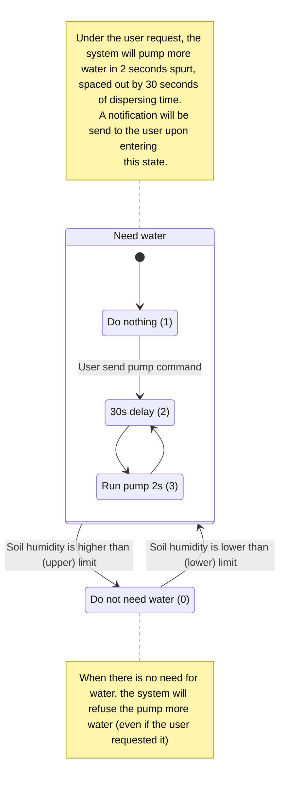

# Outline of project

Input: 
- PIR sensor - P0
- Temp and humidity (DHT20) - I2C1 port
- Soil humidity - P1 (ADC) port
- Ultra sonic - dual port P3/P6
- Camera - not really an input but needed, on laptop or phone
    - one for presence detection 
    - one for face id and presence detection

Output:
- Relay - P2
- Fan - P14/P15
- Servo - header P4
- Buzzer - onboard
- RGB LED - P16/P12
- Pump - dual port P10/P13

Functionality:
- Door control (open/close) - with face ID and proximity sensor
- Device control
    - Fan control (with PWM)
    - Other device control (with relay)
    - Light control (RGB LED), which will use AI and PIR for presence detection
- Plant watering
- Environment monitoring
    - Ground humidity
    - Air temp/humidity

# General detail from the Yolo:bit viewpoint

## Reading sensor (input)

- Using event, read the value of the sensor every x seconds:
    - PIR sensor (high/low) voltage, indicating have/have not people
    - DHT20, through I2C, update readings, then read them
    - Soil humidity, read value within range (0, 100)
    - Ultra sonic (use command to read value)

- AI result on dedicated MQTT topic: can not be read, but received from the server
    - presence detection result
    - face id result

## Control signal sent through MQTT topics

Since we are not sure about the QoS provided by the Yolo:bit, and also because we need some type of
feedback when remotely controlling the system. For each control topic, there will be a state topic
representing the current state of the peripherals. There will also be a result code topic for each
action.

All the control triplet are:
- For the door (servo)
- Fan
- Relay
- RGB LED color
- Pump

There will be other topics serving each functionality, those will be mentioned with the
functionality description.

# Specific for all use case

## Environment monitoring

### Description

Read sensor (DHT20, soil humid). For each sensor, sent info through MQTT to broker->database

### MQTT topics

- Air temp topic 
- Air humidity topic 
- Soil humidity topic

## Plan watering

### Description

The plant is watered when only when the soil humidity is low enough. The user can trigger the
watering. Upon detection of dry soil, a notification is send to the user.

To prevent over-watering, a sequence of 30s of idle time + 2s of pump run time is used. This will
hopefully ensure the water have time to spread out and affect the sensor reading (prevent pumping
too much water too fast).

### MQTT topics

- Pump control triplet
- A notification topic

## Light control

### Description

The light can be controlled remotely by the user. The user can see device state.
- Color

For the light on/off control, activation can also be achieved through 
- User control
- PIR motion detection at night.

### MQTT topics

- light color control triplet 
- human presence result from AI topic

## Fan control / Other device control

### Description

The device (fan, relay-connected device) can be controlled remotely by the user. The user can
see device state.
- For fan: PWM duty cycle
- For relay: On/Off state 

### MQTT topics

- For fan: control triplet
- For relay: control triplet

## Door control

### Description

The door can be controlled automatically. Process is as followed:

1. User come near the door (detected through ultrasound)

2. Sound the buzzer to notify user of face id

3. ID result become available  
- If face id passed, open the door
- If not, do nothing, return to step 2 after some delay time

4. Wait until ultrasound does not detect user any more, close the door 

Or the door can be controlled remotely.

### MQTT topics

- door control triplet 
- camera face id 
    - activation topic 
    - result topic 
